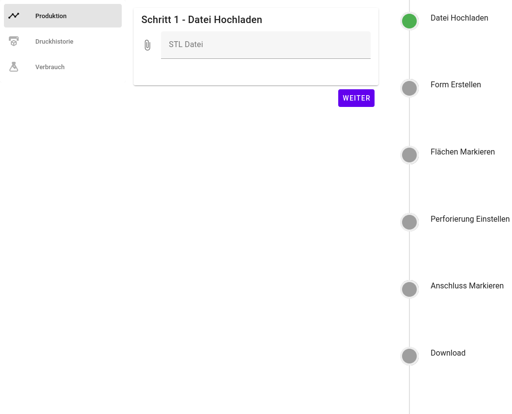
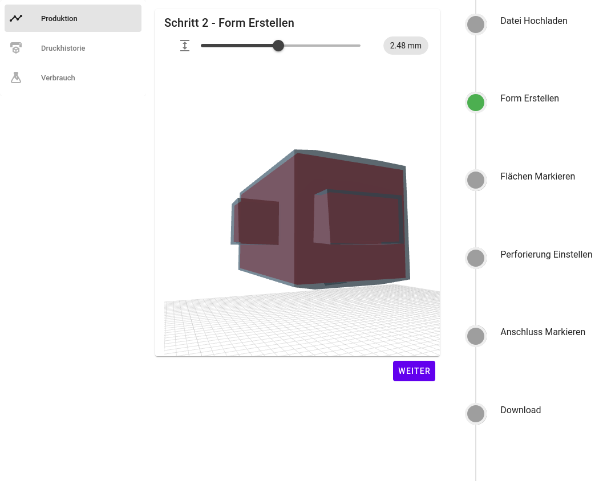
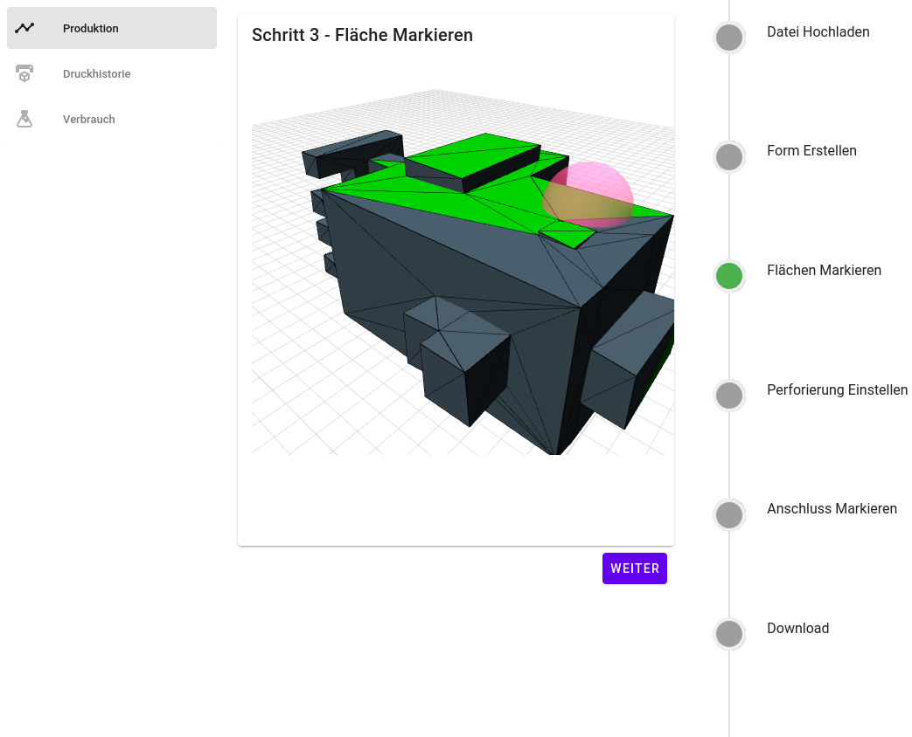
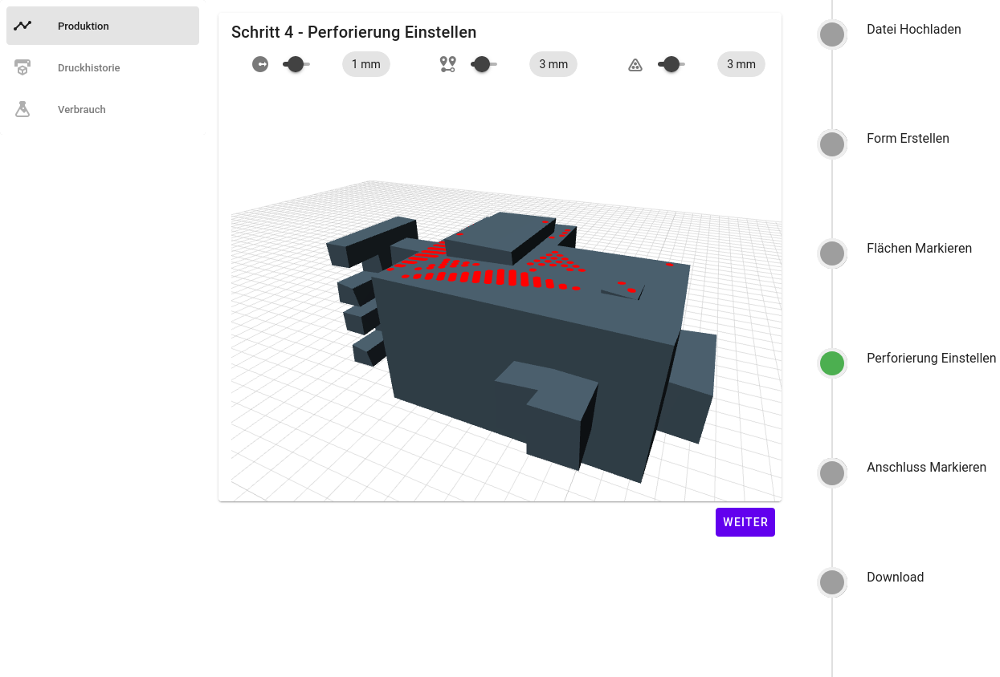
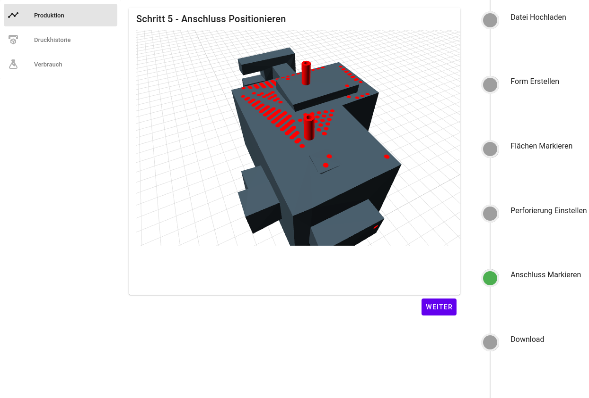
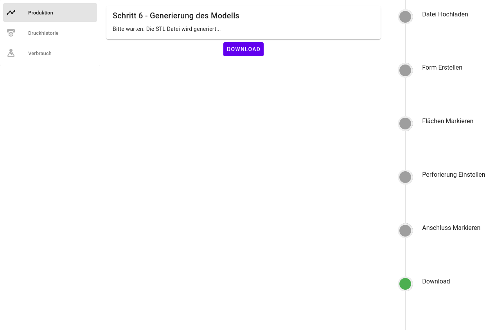

# 📐🛠 CAD Cast Form Assistant

This website enables you to create casting-forms in the browser.

## The Creation Process
#### 1. Upload STL file

#### 2. Create the cast shell and configure thickness

#### 3. Mark the surfaces to be perforated

#### 4. Configure the perforation offset and density

#### 5. Place adapter to fill the shell

#### 6. Generate and download the result

## Technology 
 The system is build with:

* [Vue3](https://vuejs.org/) 
* [Vite](https://vitejs.dev/)
* [TypeScript](https://www.typescriptlang.org/)
* [ThreeJs](https://threejs.org/) / [TroisJs](https://troisjs.github.io/)
* [Vuetify3](https://next.vuetifyjs.com/en/)

## How to use it?

1. Make sure you have installed [NodeJs](https://nodejs.org/en/download/)
2. Install all dependecies:` npm install `
3. start the dev server: `npm run dev`
4. Navigate to  [http://localhost:3000/](http://localhost:3000/)

You can also build a local preview of the production with: 

`npm run preview` 

or build the project for production with: 

`npm run build`

For all commands you can also use `yarn` instead of `npm`.

